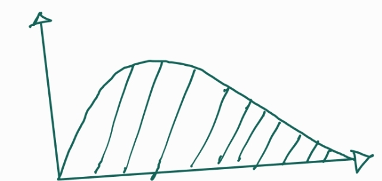

# Relating Sensitivity to ToF Filters
## The Derivation
From the sensitivity derivations,
$$
\frac {\delta I} {\delta TMP_{fetal}} = - \frac{\delta \mu_a} {\delta TMP_{fetal}} \times \frac{1}{N}\sum I_iL_{fetal,i}
$$
Where, the summation is over every simulated photon, $i = 1, 2, ... N$.(N is in the range of 1e8 to 1e9 for our simulations)

The first term on the right-hand side is essentially a cosntant wrt to ToF filtering. So, we can focus on the second term for now.  

The second term is essentially the expected value, $\mathbb{E}(I\times L_{fetal})$.  
$$
\mathbb{E}(I\times L_{fetal}) = \int I\times L_{fetal} p(L_{fetal}, I)dL_{fetal}dI
$$
We can break down the $I$ term using Beer-Lambert's law.
$$
\int I\times L_{fetal} p(L_{fetal}, I)dL_{fetal}dI = \int exp(-\sum_j\mu_{a,j} L_j)L_{fetal} p(L)(dL)
$$
where, j denotes a tissue layer in the model and $mu_{a,j}$ is its corresponding absorption cofficeint. The equation is now integrated over all L. As in, $dL = dL_1 dL_2 ... dL_{fetal}$  & $p(L) = p(L_1, L_2, ....L_{fetal})$ is the joint probability distribution of the pathlengths 

__A ToF filter can effectively change the limits of this integral__. (Well more technically speaking, a ToF filter would control the limits of time period, $t \propto \sum_j n_jL_j \approx \sum_jL_j$, with $n$ being the refractive index). In contrast, our CW measurements would integrate over the whole distribution. ($L_{min}$ to $L_{max}$).  

However, as all the terms in this integral are positive, integrating over the whole region will always be larger than any integrating over a partial region. As a result, no combination of lower and upper limits on the integral can produce a larger intgral and consequenty a larger sensitivity. CW in theory, should always achieve better sensitivity than ToF filtering. 

## Conclusion
1. Applying a ToF filter will not improve sensitivity (under the assumptions that we can achieve ideal fetal pulsation separation and the signal is noiseless)
2. ToF might produce better sensitivity if there is noise involved, in which case certain regions of the integral above might be worth discarding.
3. ToF filtering might be better used for signal filtering rather than sensitivity boosting