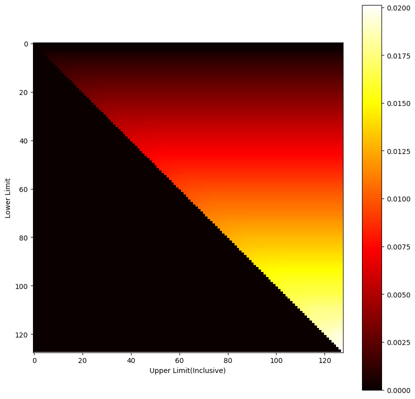
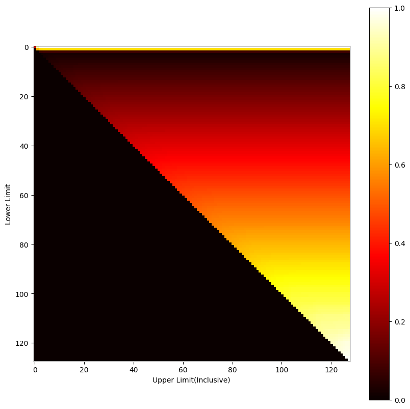

# Maazimizing iNIRS Fetal Sensitivity & SNR Simultaneously
The fetal sensitivity of iNIRS depends on strategically choosing a range of timebins, whose intensities will then be summed up to produce the fetal signal. In a noiseless setup, which is provided from our MC simulations, maximizing fetal sensitivity is analogous to choosing only the very last timebin. However, in practical setup, this bin would be riddled with noise. Appending earlier timebin would reduce noise but it would degrade fetal sensitivity. In this report, we try to investigate which singular term could act as a proxy for optmizing both terms concurrently. Our goal is to device a way to pull the optimum summing window towards earlier timebins.  

__NOTE__: The definition of SNR we use here is: Received photon count at the sample arm. In terms of simulation, we would need to replace photon count with intensity.
```math
SNR = \int_{L_{min}}^{L_{max}} I(L)dL
```
Where, $L_{min}$ and $L_{max}$ are the limits of the iNIRS timebins chosen for obtaining a fetal signal. We also assume a rectangular window during this summing process for now.  

# Heatmaps
We used heatmaps to visualize the optimum summing window. We place the summing window upper limit's index along the X-axis and the lower limit along Y. The optimization term is represented using a colored pixel at its corresponding XY co-ordinate. For example, here's a heatmap of just the Sensitivity without considering any SNR   
  

# Genrating ToF
ToF is generated from MC similation data under the following conditions.
1. Speed of light is assumed to be $c/1.4$ across the entire tissue model
2. There is no shot noise
3. Each ToF timebin has a resolution of 0.2 ns
4. ToF intensities are normalized to unit source intensity
5. Flat 4-Layered tissue model
6. Detector at 1.5cm, circular shape, 2mm radius
7. 850nm wavelength, 1cm fetal depth, 100% maternal saturation, 50% fetal saturation, maternal and fetal Hb concentration both at 11 g/dL, delta in R  0.01 g/dL, maternal and fetal blood volume fraction 10%


# Option 1 :  Sensitivity x SNR
Using our approximate terms for sesntivitiy(relative partial derivative of received intensity wrt fetal concerration or saturation), $Sensitivity \times SNR$ results in the following term
```math
\frac{\int I(L) R(L) dL}{\int I(L) dL} \times \int I(L)dL = \int I(L) R(L) dL
```  
  
The optimum window is between indices 0 to 103. This pulls it too far towards the left.

# Option 2 : (Sensitivity / Best Sensitivity) + (SNR / Best SNR)
Normalizing both terms to be in the same scale and adding. 
  
We actually get two windows. These are between 0 to 73 and at 127 to 127.

# Option 3 : Threshold 
Beyond some threshold SNR, it does not matter if we increase SNR any more. Setting this to 20% of the max possible SNR : 
    
Optimum window indices 1 to 94   
Setting it to 80%  
    
Optima between 0 to 103  
Setting it to 5%  
   
Optima between 2 to 97
