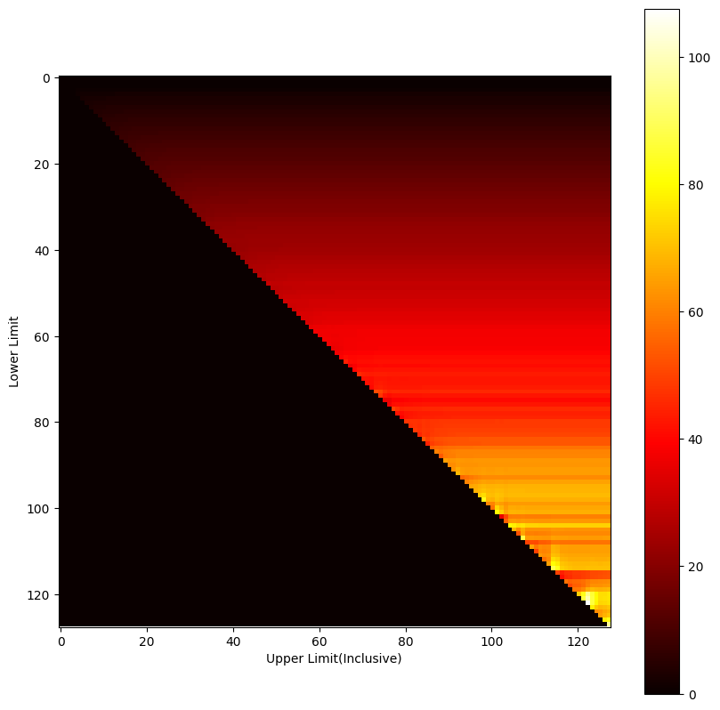

# Maazimizing iNIRS Fetal Sensitivity & SNR Simultaneously
The fetal sensitivity of iNIRS depends on strategically choosing a range of timebins, whose intensities will then be summed up to produce the fetal signal. In a noiseless setup, which is provided from our MC simulations, maximizing fetal sensitivity is analogous to choosing only the very last timebin. However, in practical setup, this bin would be riddled with noise. Appending earlier timebin would reduce noise but it would degrade fetal sensitivity. In this report, we try to investigate which singular term could act as a proxy for optmizing both terms concurrently. Our goal is to device a way to pull the optimum summing window towards earlier timebins.  

__NOTE__: The definition of SNR we use here is: Received photon count at the sample arm. In terms of simulation, we would need to replace photon count with intensity.
```math
SNR = \int_{L_{min}}^{L_{max}} I(L)dL
```
Where, $L_{min}$ and $L_{max}$ are the limits of the iNIRS timebins chosen for obtaining a fetal signal. We also assume a rectangular window during this summing process for now.  

# Heatmaps
We used heatmaps to visualize the optimum summing window. We place the summing window upper limit's index along the X-axis and the lower limit along Y. The the figure of merit/optimization term is represented using a colored pixel at its corresponding XY co-ordinate.  
**Note:** The top-right pixel denotes the figure of merit for CW measurement. This pixel marks using the entire ToF curve for the figure of merit.

For example, here's a heatmap of just the Sensitivity without considering any SNR
  


# Genrating ToF
ToF is generated from MC similation data under the following conditions.
1. Speed of light is assumed to be $c/1.4$ across the entire tissue model
2. Each ToF timebin has a resolution of 0.2 ns
3. ToF intensities are normalized to unit source intensity
4. Flat 4-Layered tissue model
5. Detector at 1.5cm, circular shape, 2mm radius
6. 850nm wavelength, 1cm fetal depth, 100% maternal saturation, 50% fetal saturation, maternal and fetal Hb concentration both at 11 g/dL, delta in R  0.01 g/dL, maternal and fetal blood volume fraction 10%

# Improvement Ratio
For any selected figure of merit(FoM), we define ratio of its value between the optimum time gated approach to the CW as the improvement ratio. 
```math
Improvement Ratio = \frac{FoM_{TimeGated,Optimum}}{FoM_{CW}}
``` 


# Option 1 :  Sensitivity x SNR
 $Sensitivity \times SNR$ results in the following figure of merit(FoM)
```math
FoM = \frac{\delta I}{\delta TMP_{fetal}} / I \times n
```
Where $n$ is the number of photons received and $I \propto n$. 
```math
FoM \propto \frac{\delta I}{\delta TMP_{fetal}}
```

Using our approximate terms for sensitivity, this results in the following expression
```math
 \int I(L) log R(L) dL
```  
  
The optimum window is between indices 0 to 103. Improvement Ratio 1.0       

# Option 2 : (Sensitivity / Best Sensitivity) + (SNR / Best SNR)
**(Ignore)**
Normalizing both terms to be in the same scale and adding. 
  
We actually get two windows. These are between 0 to 73 and at 127 to 127.

# Option 3 : Threshold 
The central theme for this FoM is that beyond some threshold SNR, we get diminishing returns. As long as SNR is above some fixed value, we should only improve sensitivity. We can express this in an equation form as
```math
FoM = \frac{\delta I}{\delta TMP_{fetal}} / I \times Boolean(SNR > Threshold)
```
Where the boolean part will evaluate to either 1 on 0 based on the condition.

We assume the CW intensity(Intensity sum over all timegates) as the max and express the threshold as its percentage.  

 Setting this to 20% of the max possible SNR : 
    
Optimum window indices 1 to 94   
Improvement Ratio 1.4246001324978765        
Setting it to 80%  
Improvement Ratio 1.0       
    
Optima between 0 to 103  
Setting it to 5%  
   
Optima between 2 to 97      
Improvement Ratio 11.259876799373993        

# Option 4 : Specificity 1
```math
FoM = \frac{Sensitivity}{p_{maternal}} = \frac{\delta I}{\delta TMP_{fetal}} / I \times \frac{1}{p_{maternal}}
```
Where, $p_{maternal}$ is the optical pathlength through the maternal layers.

For our case, this evaluates to the sensitivity dividied log(R(L)) term, which is proportional to the maternal pathlength.
```math
\int \frac{I(L) log (R_{fetal}(L))}{log(R_{maternal}(L))} dL
```     
Both R's are calculated in a similar fashion. A point where only the maternal feature changes/or only the fetal feature changes.    
           
Optima between 0 95            
Improvement Ratio 1.0

# Option 4 : Specificity 2
Define specificity as the ratio between the fetal to maternal sensitivity.
```math
FoM = \frac{Sensitivity_{fetal}}{Sensitivity_{fetal}} = \frac{\delta I}{\delta TMP_{fetal}} \times (\frac{\delta I}{\delta TMP_{maternal}})^{-1}
```   

Translating this to our setup
```math
\frac{\int I(L) log(R_{fetal}(L)) dL}{\int I(L)dL} / \frac{\int I(L) log(R_{maternal}(L))dL}{\int I(L)dL} = \frac{\int I(L) log(R_{fetal}(L))dL}{\int I(L) log(R_{maternal}(L))dL}
```
           
Optima at 122       
Improvement Ratio 7563.298966665463

# Option 5 : Specificity 3
Dividing fetal sensitivity by the **exponent** of the maternal pathlength  
```math
FoM = \frac{Sensitivity}{exp(p_{maternal})} = \frac{\delta I}{\delta TMP_{fetal}} / I \times \frac{1}{exp(p_{maternal})}
```

```math
specificity = \int \frac{I(L) log (R_{fetal}(L))}{exp(log(R_{maternal}(L)))}
```     
           
Optima between 0 to 95      
Improvement Ratio 1.0


# Option 6 : Specificity 2 x SNR
```math
FoM = \frac{Sensitivity_{fetal}}{Sensitivity_{fetal}} \times n
```
           
Optima between 0 to 103          
Improvement Ratio 1.0


# Table
| Option Number | Option Name | Optimum Window Indices | Improvement Ratio |
|---------------|-------------|------------------------|-------------------|
| 1             | Sensitivity x SNR | 0 to 103 | 1.0 |
| 2             | (Sensitivity / Best Sensitivity) + (SNR / Best SNR) | 0 to 73, 127 to 127 | N/A |
| 3             | Threshold | 1 to 94 (20% threshold), 0 to 103 (80% threshold), 2 to 97 (5% threshold) | 1.4246001324978765 (20% threshold), 1.0 (80% threshold), 11.259876799373993 (5% threshold) |
| 4             | Specificity 1 | 0 to 95 | 1.0 |
| 5             | Specificity 2 | 122 | 7563.298966665463 |
| 6             | Specificity 3 | 0 to 95 | 1.0 |
| 7             | Specificity x SNR | 0 to 103 | 1.0 |


